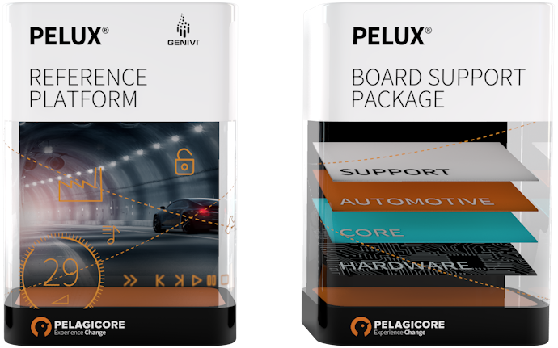

---
# You don't need to edit this file, it's empty on purpose.
# Edit theme's home layout instead if you wanna make some changes
# See: https://jekyllrb.com/docs/themes/#overriding-theme-defaults
layout: home
---

The PELUX Base Platform is a Linux platform that is used to kick-start a project for automotive software
development. The PELUX Base Platform software architecture and design are optimized to secure the shortest path
from silicon to pixel and thereby provides optimal patterns to deliver a stunning in-vehicle infotainment solution.

Though PELUX is not limited to infotainment systems. It aims to target other converged automotive systems,
like the advanced driver-assistance systems (ADAS) and telematics units.

PELUX leverages well known open source projects such as Linux, Yocto/OpenEmbedded and GENIVI in order to provide
a base development platform. The base development platform is complemented by project blueprints and documentation.

The project has one main goal in mind - to provide a leading development experience in Embedded Linux device creation,
tailored to automotive needs. 

Please [join us on IRC](get-involved) and we can answer all the questions you might have.
